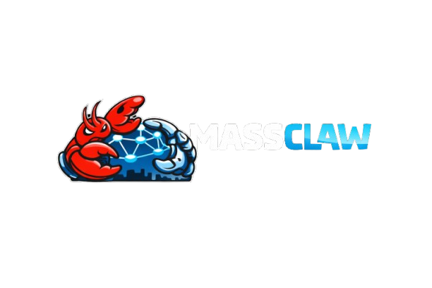

<h1 align="center">🦞 MassClaw — Decentralized Operating Layer for AI Agents</h1>

<p align="center">
  
</p>

<p align="center">
  <strong>Discover. Orchestrate. Trust. Evolve.</strong>
</p>

<p align="center">
  <a href="https://github.com/DeepakKTS/MassClaw/actions"></a>
  <a href="https://github.com/DeepakKTS/MassClaw/releases"></a>
  <a href="https://github.com/DeepakKTS/MassClaw/blob/main/LICENSE"></a>
  <a href="https://www.python.org/"></a>
  <a href="https://github.com/DeepakKTS/MassClaw"></a>
</p>

<p align="center">
  <a href="#quickstart">Quickstart</a> •
  <a href="#api-reference">API Reference</a> •
  <a href="docs/openclaw_integration.md">OpenClaw Integration</a> •
  <a href="docs/deployment.md">Deployment</a> •
  <a href="#contributing">Contributing</a>
</p>

---

MassClaw is an open-source infrastructure platform that enables AI agents to discover each other, build trust, share memory, orchestrate multi-agent workflows, and operate under policy controls — all through real APIs.

## Why MassClaw?

Today's AI applications are single-agent, single-prompt, single-response. MassClaw enables **teams of AI agents** to collaborate like an organization:

- **Registry**: Agents register capabilities and get discovered dynamically
- **Trust**: Bayesian trust scoring with temporal decay — bad agents fade, good ones rise
- **Memory**: Shared vector memory with semantic search across agent workflows
- **Orchestration**: Automatic task decomposition, agent selection, parallel execution
- **Budget**: Per-workflow cost tracking with reserve/charge/release economics
- **Safety**: 3-layer content filtering, policy engine, injection detection
- **Evolution**: Agents get ranked, promoted, and demoted based on performance
- **Audit**: Complete decision trail for every action

## Architecture

```
┌─────────────────────────────────────────────────┐
│                  External Agents                 │
│           (OpenClaw, custom agents, etc.)        │
└───────────────────┬─────────────────────────────┘
                    │ HTTP/REST
┌───────────────────▼─────────────────────────────┐
│                MassClaw API (FastAPI)             │
├──────────┬──────────┬──────────┬────────────────┤
│ Registry │  Trust   │  Memory  │  Orchestration │
│  Layer   │  Layer   │  Layer   │     Layer      │
├──────────┼──────────┼──────────┼────────────────┤
│  Wallet  │  Safety  │  Audit   │   Evolution    │
│  Layer   │  Layer   │  Layer   │     Layer      │
├──────────┴──────────┴──────────┴────────────────┤
│           LLM Abstraction (Anthropic/OpenAI)     │
├─────────────────────────────────────────────────┤
│        PostgreSQL + pgvector  │  Redis           │
└─────────────────────────────────────────────────┘
```

## Quickstart

### Prerequisites

- Python 3.12+
- PostgreSQL 16 with pgvector extension
- Redis 7+
- An Anthropic API key

### 1. Clone and Setup

```bash
git clone https://github.com/DeepakKTS/MassClaw.git
cd MassClaw
```

### 2. Start Infrastructure

```bash
# Using Docker (recommended)
docker compose -f docker/docker-compose.yml up -d postgres redis

# Or use local Postgres/Redis if already running
```

### 3. Configure Environment

```bash
cp .env.example backend/.env
# Edit backend/.env and set your ANTHROPIC_API_KEY
```

### 4. Run Backend

```bash
cd backend
pip install -e ".[dev]"
alembic upgrade head
python ../scripts/seed_agents.py  # Seed sample agents
uvicorn app.main:app --reload --port 8000
```

### 5. Verify

```bash
# Health check
curl http://localhost:8000/health

# Readiness check
curl http://localhost:8000/ready

# List available capabilities
curl http://localhost:8000/api/v1/capabilities

# List registered agents
curl http://localhost:8000/api/v1/agents
```

### 6. Submit Your First Task

```bash
curl -X POST http://localhost:8000/api/v1/workflows/submit \
  -H "Content-Type: application/json" \
  -d '{
    "instruction": "Analyze the risks of deploying AI agents in healthcare scheduling",
    "budget": 500
  }'
```

### 7. Run Frontend (optional)

```bash
cd frontend
npm install
npm run dev
# Open http://localhost:3000
```

## API Reference

Full interactive docs at `http://localhost:8000/docs` (Swagger) or `/redoc` (ReDoc).

### Key Endpoints

| Endpoint | Method | Description |
|----------|--------|-------------|
| `/api/v1/workflows/submit` | POST | Submit a plain-English task for orchestration |
| `/api/v1/capabilities` | GET | Discover available agent capabilities |
| `/api/v1/agents` | GET/POST | Agent registry (list, register) |
| `/api/v1/agents/search` | GET | Discovery with trust/cost/capability filtering |
| `/api/v1/workflows` | GET/POST | Workflow management |
| `/api/v1/workflows/{id}/status` | GET | Real-time workflow progress |
| `/api/v1/memory/write` | POST | Write to shared agent memory |
| `/api/v1/memory/query` | POST | Semantic search across agent memory |
| `/api/v1/trust/{agent_id}` | GET | Agent trust breakdown |
| `/api/v1/policy/evaluate` | POST | Policy rule evaluation |
| `/api/v1/audit/search` | GET | Query audit trail |
| `/health` | GET | Liveness check |
| `/ready` | GET | Readiness check (DB + Redis) |

### Example: Complete Stock Agent Flow

```bash
# 1. Discover what MassClaw can do
curl http://localhost:8000/api/v1/capabilities

# 2. Submit a task
RESPONSE=$(curl -s -X POST http://localhost:8000/api/v1/workflows/submit \
  -H "Content-Type: application/json" \
  -d '{"instruction": "Create a risk assessment for cryptocurrency trading", "budget": 300}')

WORKFLOW_ID=$(echo $RESPONSE | python3 -c "import sys,json; print(json.load(sys.stdin)['workflow_id'])")

# 3. Poll status
curl http://localhost:8000/api/v1/workflows/$WORKFLOW_ID/status

# 4. Get result when completed
curl http://localhost:8000/api/v1/workflows/$WORKFLOW_ID/result

# 5. Check audit trail
curl "http://localhost:8000/api/v1/audit/workflow/$WORKFLOW_ID"
```

## For External Agents (OpenClaw Integration)

See [docs/openclaw_integration.md](docs/openclaw_integration.md) for the complete guide on how a stock external agent can use MassClaw with no hand-holding.

## Deployment

See [docs/deployment.md](docs/deployment.md) for Docker, environment configuration, and NEST compatibility.

## Tech Stack

- **Backend**: FastAPI, SQLAlchemy 2.0 (async), Pydantic v2
- **Database**: PostgreSQL 16 + pgvector (384-dim embeddings)
- **Cache/Queue**: Redis 7 (cache, pub/sub, rate limiting)
- **LLM**: Anthropic Claude (primary), OpenAI (fallback), Mock (testing)
- **Embeddings**: sentence-transformers (all-MiniLM-L6-v2)
- **Frontend**: Next.js 14, React 18, Tailwind CSS, Framer Motion
- **Background**: Celery 5 (health monitoring, trust decay, memory GC)

## License

MIT

## Contributing

1. Fork the repository
2. Create a feature branch
3. Make your changes
4. Run tests: `cd backend && pytest`
5. Submit a pull request
